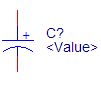

# BASE

## CAP

1. CAP PLO/SM

   

   有极性插件电容

2. TANTALUM CAP

   钽电容

## REG

## INDU

1. INDUCTOR SM

   贴片电感

# 二极管类diode

## 肖特基二极管

1. BAT54C

   

2. SBD

   肖特基二极管

3. DIODE

   通用二极管

4. PIZEO

   有源蜂鸣器

# KEY

## Side key

1.  ST-1114A

   

# 晶振CRYSTAL

# MCU

## STM32

1. STM32F103RC

# IC

1. DC-DC
   1. TPS5430
2. LDO
   1. AMS1117
   2. ME6211C

# 其他

1. CRYSTAL 2P

   晶振

2. M2

   M2螺孔

